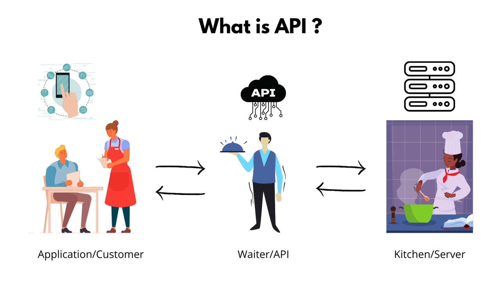
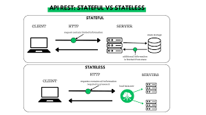
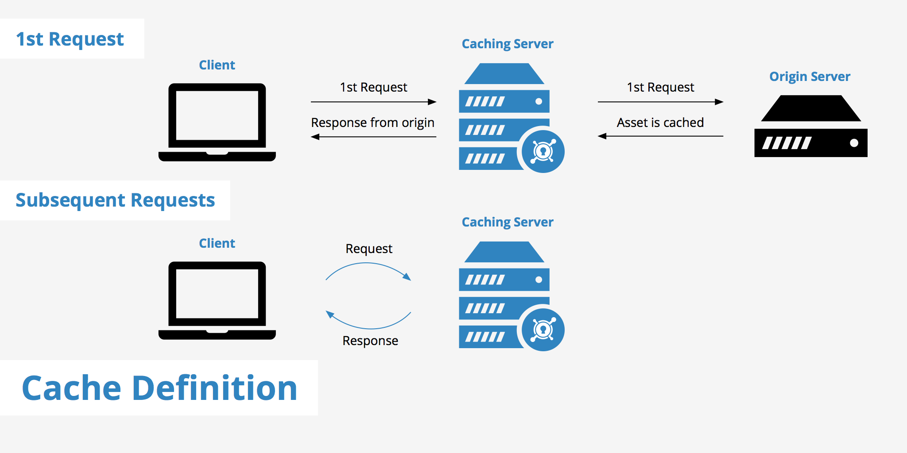

# Everything APIs

API stands for Application Programming Interface. Using set definitions and protocols it allows two software components, or software themselves to communicate with each other and send data in their own language. See an API Like a software middleman or translator.
* **How are APIs used?:** Their general function is to take user input and translate it into data a system can use to send back the correct response. e.g you press pay on a shopping site, an API will let that system know you've done so, prompting it to take you to the page where you input your card information. <b>

* **Why are APIs so popular?** They are great time savers for developers allowing them to automate, instead of writing huge amounts of code. It allows for a incredible level of accessibility, communication and data sharing, important for business to gather data and users to use. e.g  Using your facebook sign in to access multiple websites? API. Booking an UBER? API. Posting an instagram pic? API

## Data transfer process of APIs

## What is REST API

REST API is a software framework imposed on APIs to ensure they are secure when communicating over a complex network such as the internet.  
* **What makes an API RESTful?** When an API adheres to the design principles of REST (REpresentational State Transfer) it is known as RESTful.
* **What are the REST API guidelines?** Uniform interface, statelessness, layered system, cacheability, code on demand.

# What is HTTP?

HTTP stands for **Hyper Text Transfer Protocol**. It is an application layer protocol design for the transferring of data and files over the internet.

HTTPS is similar to HTTP, the 'S' standing for secure. It makes sure that the data that is being transferred is secure. Where with HTTP the files in transfer are not secure and can be intercepted.

# HTTP request structure

# HTTP response structure

# The 5 HTTP verbs

The 5 HTTP verbs are:
* GET - makes a request of the target server
* POST - creates a new resource 
* PUT - put updates a resource completely
* DELETE - deletes specified resource
* PATCH - makes a partial update on a resource

# What is statelessness 

Statelessness refers to the communication method whereby the server completes each client request independently of all the requests before it. 

* The request contains all the information needed to process without external information.   
* A stateful refers to a request that has limited information and will need to fetch additional information from state(server). It is reliant on preceding requests to be fulfilled before it is processed. 

### Stateless vs Stateful

# What is caching? 

Caching is the storing of frequently accessed or used data in a temporary location. This allows for quicker access times as a result of not needing to query the server.

